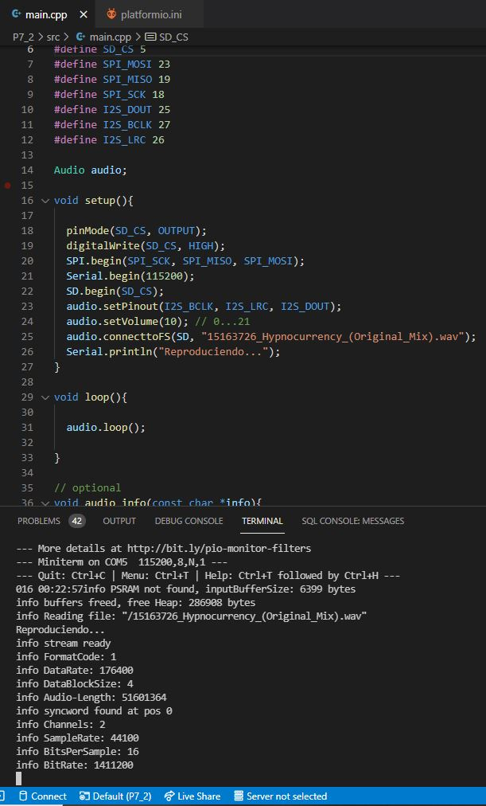

# PRACTICA 7_2  : Reproducir un archivo WAVE en ESP32 desde una tarjeta SD externa

## 1.Salida del terminal

## 2.Explicación del código

En este apartado de la práctica 7, se trabaja con especificaciones similares a la anterior, con la diferencia de que ahora se utilizará la comunicación SPI para importar un archivo de audio con formato ".wav" almacenado en una tarjeta SD. Para decodificar los datos del audio se utilizará de nuevo la placa MAX98357 con protocolo I2S. Así pues, se trabajará la comunicación SPI y I2S.

El código comienza con las definiciones de las librerias necesarias en este caso y, de 7 pines necesarios para realizar las comunicaciones SPI y I2S, además de un objeto de la clase Audio, donde posteriormente se explicará para qué se utiliza.

En el setup, incializamos las líneas de código necesarias para establecer la comunicación SPI mediante el lector de tarjeta SD. Más tarde, se inicializa el Serial y, luego, utilizamos 3 funciones definidas en la clase Audio que habíamos definido anter de programar el setup. La primera función corresponde a "audio.setPinout(I2S_BCLK, I2S_LRC, I2S_DOUT)", donde se especifican los pines de salida I2S. La segunda, "audio.setVolume(10)", se encarga de delimitar el volumen del audio a la hora de reproducirlo y, la tercera, "audio.connecttoFS(SD, "15163726_Hypnocurrency_(Original_Mix).wav")", cuya función es importar el archivo contenido en la tarjeta SD.

En el loop, simplemente se incializa el loop del objeto audio, que contiene el archivo de música que hayamos almacenado en la SD.

Finalmente, mostramos por el terminal, información técnica del archivo .wav reproducido como: FormatCode, DataRate, DataBlockSize, Audio-Length, Channels, SampleRate, BitsPerSample, BitRate.